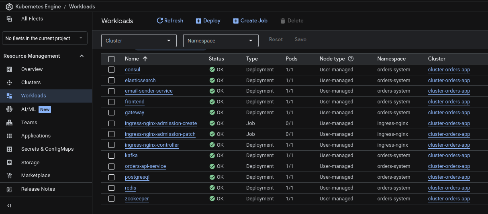

# Orders API Deployment

Infrastructure repository for Kubernetes deployment manifests. The Orders API system is deployed on Google Kubernetes Engine (GKE) using a microservices architecture with event-driven communication.

## Architecture Preview



### High-Level Architecture overview

```
                                    ┌─────────────────────────────────────┐
                                    │            GKE Cluster              │
                                    │                                     │
┌──────────┐                        │  ┌──────────────────────────────┐   │
│  User    │──────Internet──────────┼─▶│   Nginx Ingress Controller   │   │
└──────────┘                        │  └──────────────────────────────┘   │
                                    │               │                     │
                                    │               ▼                     │
                                    │  ┌──────────────────┐               │
                                    │  │  Ingress Routes  │               │
                                    │  ├──────────────────┤               │
                                    │  │ /*               │─────────┐     │
                                    │  │ /api/*           │──────┐  │     │
                                    │  │ /oauth/*         │───┐  │  │     │
                                    │  └──────────────────┘   │  │  │     │
                                    │                         │  │  │     │
                                    │        ┌────────────────┘──┘  │     │
                                    │        ▼                      ▼     │
                                    │  ┌──────────────┐   ┌─────────────┐ │
                                    │  │   Gateway    │◀──│   Frontend  │ │
                                    │  │  (OAuth)     │   │ (nginx:80)  │ │
                                    │  │    :1000     │   └─────────────┘ │
                                    │  └──────────────┘                   │
                                    │          │                          │
                                    │          ▼                          │
                                    │  ┌──────────────────────────────┐   │
                                    │  │      Backend Services        │   │
                                    │  │  • Orders API (8080)         │   │
                                    │  │  • Email Sender (8081)       │   │
                                    │  └──────────────────────────────┘   │
                                    │                  │                  │      
                                    │                  ▼                  │
                                    │  ┌──────────────────────────────┐   │
                                    │  │        Infrastructure        │   │
                                    │  ├──────────────────────────────┤   │
                                    │  │ • Consul                     │   │
                                    │  │ • Redis                      │   │
                                    │  │ • PostgreSQL                 │   │
                                    │  │ • Kafka + Zookeeper          │   │
                                    │  │ • Elasticsearch              │   │
                                    │  └──────────────────────────────┘   │
                                    │                                     │
                                    └─────────────────────────────────────┘
```

## Request Flow

### 1. User Authentication (OAuth)

```
User → Nginx Ingress → Gateway → Google OAuth
                 ↓
            Creates Session
                 ↓
         Stores in Redis
                 ↓
         Sets Cookie
                 ↓
      Redirects to Frontend
```

### 2. API Request Flow

```
User (with session cookie)
    ↓
Nginx Ingress (/api/*)
    ↓
Gateway (validates session in Redis)
    ↓
Service Discovery (Consul)
    ↓
Backend Service (Orders API / Email Sender)
    ↓
Database (PostgreSQL / Elasticsearch)
```

### 3. Async Event Processing

```
Orders API (create order)
    ↓
Kafka Producer (emailSend topic)
    ↓
Email Sender Service (Kafka Consumer)
    ↓
SMTP Server (send email)
    ↓
Elasticsearch (store email history)
```

## Services Breakdown

### **Frontend Layer**

| Component | Port | Purpose |
|-----------|------|---------|
| **Nginx Ingress** | 80/443 | External load balancer, SSL termination, routing |
| **Frontend (React)** | 80 | Single Page Application, serves UI |

### **Gateway Layer**

| Component | Port | Purpose |
|-----------|------|---------|
| **API Gateway** | 1000 | OAuth authentication, session management, request routing |

### **Application Layer**

| Component | Port | Purpose |
|-----------|------|---------|
| **Orders API** | 8080 | Customer & order management, CRUD operations, reports |
| **Email Sender** | 8081 | Async email delivery, retry mechanism, email tracking |

### **Infrastructure Layer**

| Component | Port | Purpose |
|-----------|------|---------|
| **Consul** | 8500 | Service discovery, health checks |
| **Redis** | 6379 | Session storage for Gateway |
| **PostgreSQL** | 5432 | Relational database for orders/customers |
| **Kafka** | 9092 | Message broker for async events |
| **Zookeeper** | 2181 | Kafka coordination |
| **Elasticsearch** | 9200 | Email tracking and search |

## Networking

### Ingress Routes

The Nginx Ingress Controller routes traffic based on URL paths:

| Path | Target Service | Description |
|------|----------------|-------------|
| `/oauth/*` | Gateway | OAuth authentication flow |
| `/api/*` | Gateway → Backend | All API requests (authenticated) |
| `/*` | Frontend | React SPA (catch-all) |

### URL Routing

```
Ingress (nginx)
├── /oauth/*          → Gateway (OAuth flow)
│   ├── /oauth/authenticate
│   └── /oauth/callback    ← Google redirects here
├── /api/*            → Gateway → Backend services
└── /*                → Frontend (React SPA)
    └── /oauth-callback    ← Gateway redirects here after auth
```

### Internal Communication

- **Service Discovery**: All services register with Consul and discover each other dynamically
- **Load Balancing**: Kubernetes ClusterIP services provide internal load balancing
- **Health Checks**: Consul monitors service health, Kubernetes uses readiness/liveness probes

## Monitoring & Observability

All services expose `/actuator/health` endpoints for:
- Kubernetes readiness probes
- Kubernetes liveness probes
- Consul health checks

## Deployment Process

```
┌─────────────────────────────────────────────────────────────────────────────┐
│  orders-ms-oauth-gateway (app repo)      orders-api-deployment (this repo)  │
│                                                                             │
│  Push code ──► Build images ──► repository_dispatch ──► Deploy to GKE       │
│                                                                             │
│  [build-and-push.yml]                                  [deploy.yml]         │
└─────────────────────────────────────────────────────────────────────────────┘
```

1. **Build**: Docker images built in app repositories
2. **Push**: Images pushed to GitHub Container Registry
3. **Deploy**: Kustomize applies manifests to GKE
4. **Update**: Rolling updates with zero downtime
5. **Verify**: Health checks ensure successful deployment

---

## Repository Structure

```
orders-api-deployment/
├── .github/workflows/
│   └── deploy.yml                    # Deploy to GKE workflow
├── kustomize/
│   ├── base/
│   │   ├── namespace/                # Namespace definition
│   │   ├── consul/                   # Service discovery
│   │   ├── redis/                    # Session storage
│   │   ├── elasticsearch/            # Email tracking storage
│   │   ├── zookeeper/                # Kafka coordination
│   │   ├── kafka/                    # Message broker
│   │   ├── postgresql/               # Orders database
│   │   ├── orders-api-service/       # Main API service
│   │   ├── email-sender-service/     # Email notification service
│   │   ├── gateway/                  # API Gateway with OAuth
│   │   ├── ingress/                  # External access
│   │   └── kustomization.yml         # Base configuration
│   └── kustomization.yml             # Image versions
├── scripts/
│   ├── create-secrets.sh             # Create K8s secrets
│   └── deploy.sh                     # Manual deployment script
└── README.md
```

## GitHub Secrets Required

### GKE Access
| Secret | Description | Example |
|--------|-------------|---------|
| `GKE_PROJECT` | Google Cloud Project ID | `my-project-123456` |
| `GKE_CLUSTER` | GKE Cluster name | `orders-api-cluster` |
| `GKE_ZONE` | GKE Zone | `europe-west1-b` |
| `GKE_SA_KEY` | Service Account JSON key | `{ "type": "service_account", ... }` |

### Application Secrets
| Secret | Description                                         | Example |
|--------|-----------------------------------------------------|---------|
| `POSTGRES_PASSWORD` | PostgreSQL password                                 | `securepass123` |
| `MAIL_HOST` | SMTP server                                         | `smtp.gmail.com` |
| `MAIL_PORT` | SMTP port                                           | `587` |
| `MAIL_USERNAME` | Email username                                      | `noreply@example.com` |
| `MAIL_PASSWORD` | Email password                                      | `app-specific-password` |
| `OAUTH_GOOGLE_CLIENT_ID` | Google OAuth Client ID                              | `123-abc.apps.googleusercontent.com` |
| `OAUTH_GOOGLE_CLIENT_SECRET` | Google OAuth Secret                                 | `GOCSPX-abc123...` |
| `FRONTEND_URL` | Frontend URL for CORS (leave empty for same domain) | `https://app.example.com` |

### Optional
| Secret | Description | Default |
|--------|-------------|---------|
| `IMAGE_OWNER` | GitHub username for images | `github.repository_owner` |

## App Repository Setup

The app repository (`orders-ms-oauth-gateway`) needs:

| Secret | Description |
|--------|-------------|
| `DEPLOY_REPO_TOKEN` | Personal Access Token with `repo` scope |

### Creating the PAT

1. Go to GitHub Settings → Developer settings → Personal access tokens → Tokens (classic)
2. Generate new token with `repo` scope
3. Add as `DEPLOY_REPO_TOKEN` secret in `orders-ms-oauth-gateway` repository

## Services Overview

### Application Services

#### Frontend (Port 80)
- React SPA
- nginx server
- Serves UI
- Handles OAuth callback page
- Proxies API requests to Gateway

#### Gateway (Port 1000)
- Spring Cloud Gateway
- Google OAuth authentication
- Session management with Redis
- Service discovery with Consul
- Routes requests to backend services

#### Orders API Service (Port 8080)
- RESTful API for order management
- Customer management
- Report generation (CSV/Excel)
- Kafka producer for email events
- PostgreSQL for data persistence

#### Email Sender Service (Port 8081)
- Kafka consumer for email events
- Email delivery with retry mechanism
- Elasticsearch for email tracking
- Scheduled retry jobs with ShedLock

### Infrastructure Services

#### Consul (Port 8500)
- Service discovery
- Health checking
- Distributed configuration

#### Redis (Port 6379)
- Session storage for Gateway
- High-performance cache

#### Elasticsearch (Port 9200)
- Email tracking and history
- Search capabilities

#### Kafka + Zookeeper (Ports 9092, 2181)
- Asynchronous messaging
- Event-driven architecture
- Email event streaming

#### PostgreSQL (Port 5432)
- Orders and customers data
- Liquibase migrations

## Manual Deployment

```bash   
# Trigger deployment via GitHub Actions UI (workflow_dispatch)
# Or use gh CLI:
gh workflow run deploy.yml -f services=all -f image_tag=latest
```

### Local Deploy

```bash
# Connect to cluster
gcloud container clusters get-credentials CLUSTER_NAME --zone ZONE

# Create secrets
./scripts/create-secrets.sh

# Deploy
kubectl apply -k kustomize/
```

## CI/CD Pipeline

### Build Pipeline (in app repository)
1. Code pushed to `main` branch
2. Tests run
3. Docker images built
4. Images pushed to GHCR
5. Deployment triggered via `repository_dispatch`

### Deployment Pipeline (this repository)
1. Receives `repository_dispatch` event
2. Updates image tags in `kustomization.yml`
3. Applies changes to GKE
4. Waits for rollout completion
5. Commits updated image tags

## Contributing

1. Fork the repository
2. Create a feature branch
3. Make changes to manifests
4. Test locally with `./scripts/deploy.sh --dry-run`
5. Submit a pull request

## License

MIT License - feel free to use this as a reference for your own deployments.

## Support

For issues related to:
- **Application code**: See `orders-ms-oauth-gateway` repository
- **Deployment manifests**: Open an issue in this repository
- **Kubernetes**: Check [Kubernetes documentation](https://kubernetes.io/docs/)
- **GKE**: Check [GKE documentation](https://cloud.google.com/kubernetes-engine/docs)

## Related Repositories

- [orders-ms-oauth-gateway](https://github.com/halmber/orders-ms-oauth-gateway) - Application source code
- [orders-react-client](https://github.com/halmber/orders-react-client) - Frontend
